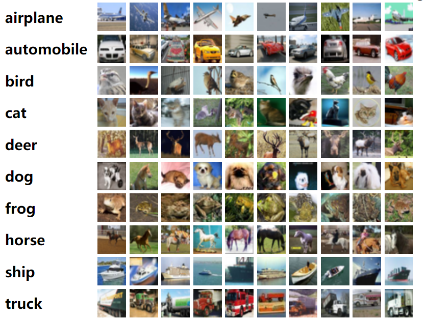
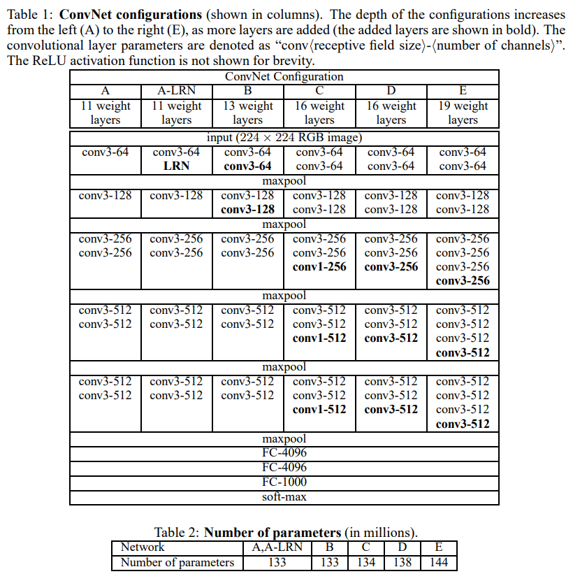
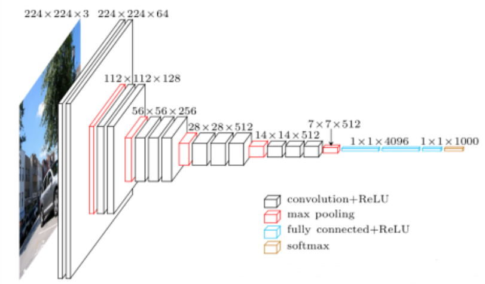
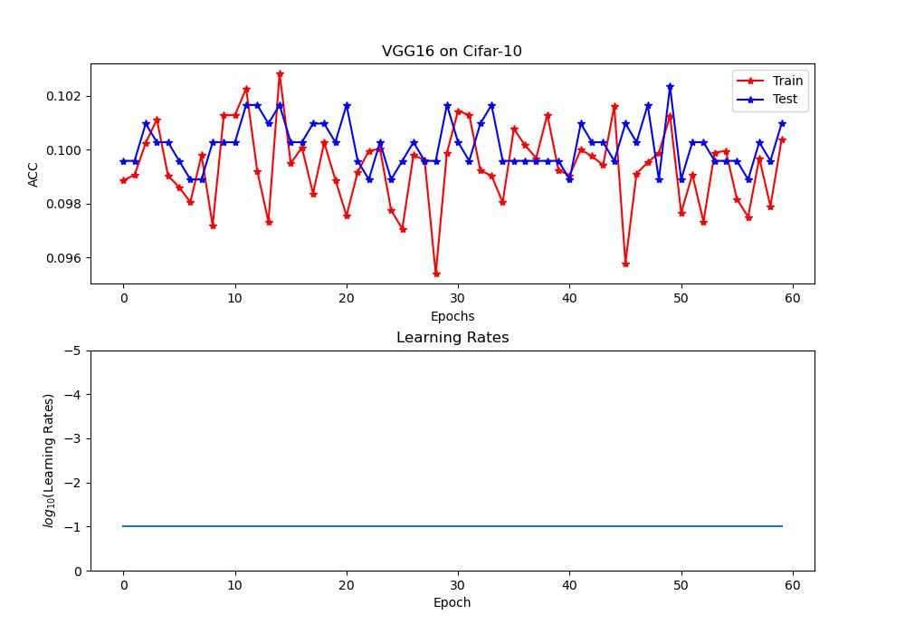
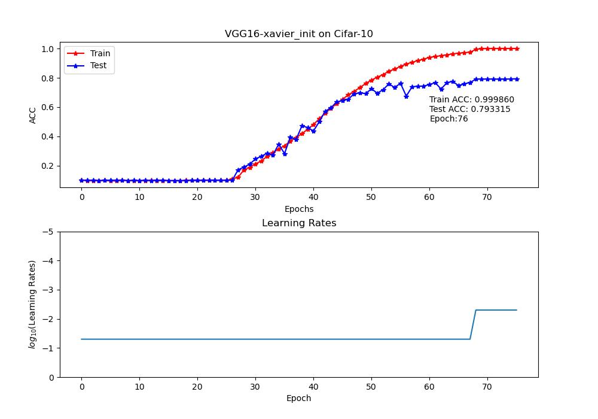
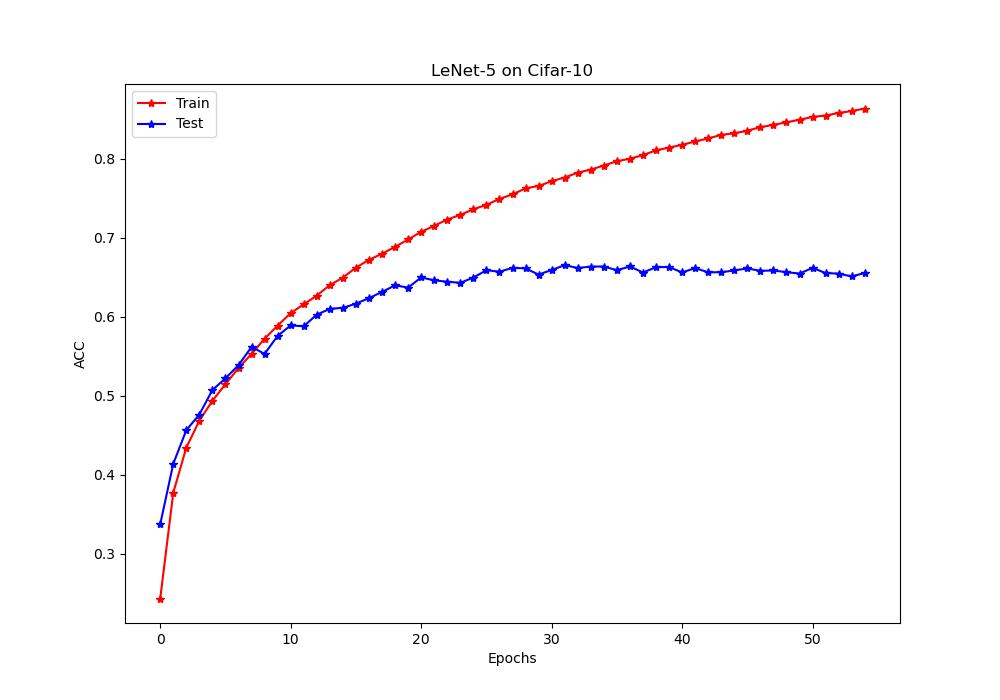
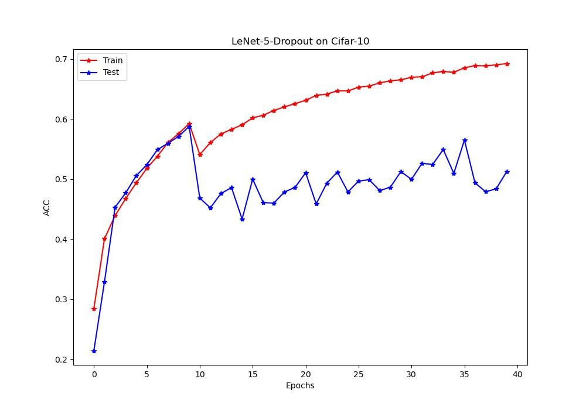
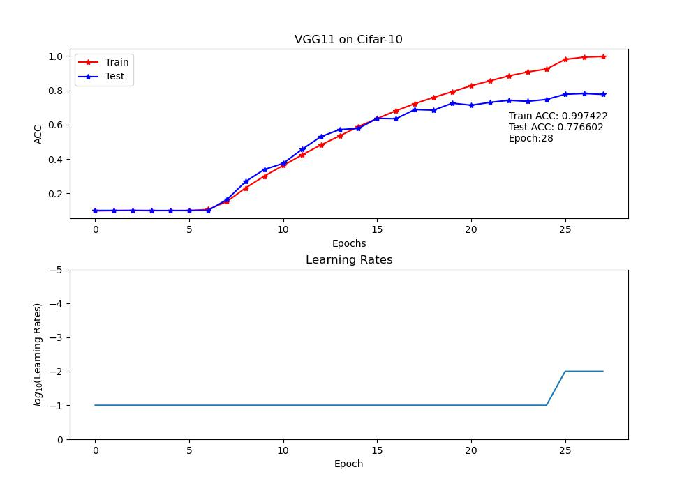
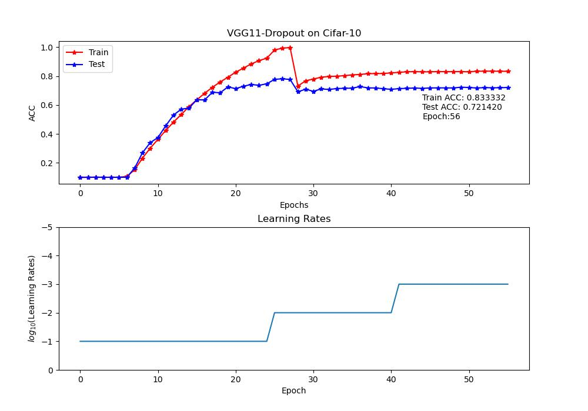
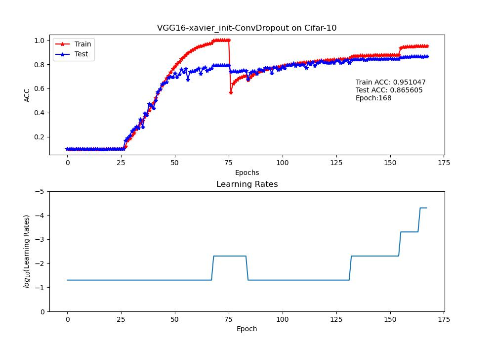

# 基于Pytorch复现VGG网络在CIFAR10数据集的实现


本文使用了Pytorch构建了一个 **“精简”** 的VGG网络结构，实现了对于CIFAR10数据集的分类，经过一定优化后可以获得较高的准确率。（CIFAR10的图片输入大小为`32x32`，而默认的VGG输入大小为`224x224`，参数可以被减少）

**优点**：实现了自动保存训练参数，绘图显示训练过程，学习率，训练结果等等信息的功能。

> VGG网络形成的网络结构参数较多，即便是“精简”的网络结构，也需要大约`40M`左右的参数存储空间，仓库内暂时不上传训练好的模型参数。本仓库内所有VGG模型的代码均能得到训练集95%+、测试集70%+的结果（训练集可以过拟合至99.99%，但测试集不佳），经过调整的VGG16最后可以得到训练集95%，测试集85%的效果，如有疑问或需要模型参数请通过`Issue`联系作者。

## 本仓库使用方法
本仓库根目录下的的Python脚本按照作者构建仓库时的使用顺序，从先到后依次进行了标注。

>imports/ 文件夹中包含了一些必要的小组件，比如训练过程中保存参数的组件以及解码重组数据集时需要的小组件。

### 文件概述
仓库内并未提供原始数据集，初次使用请先运行[`1-DonloadAndReformDataset.py`](1-DonloadAndReformDataset.py)以下载数据集，并以适于模型读取的格式转存数据集为`*.npy`文件。会在当前路径创建一个名为`Cifar-10_Unpacked`的文件夹来储存这些文件。**后续所有模型都会从此处读取文件。**

[`2-LeNet-5.py`](2-LeNet-5.py)和[`3-LeNet-5-Dropout.py`](3-LeNet-5-Dropout.py) 对于本任务提供了一个简单的LeNet-5的实现作为对照，前者不带有Dropout层，后者在卷积层中添加了Dropout层。

> Dropout提出于：[论文《Dropout: a simple way to prevent neural networks from overfitting》](https://www.jmlr.org/papers/volume15/srivastava14a/srivastava14a.pdf?utm_content=buffer79b43&utm_medium=social&) 可以有效减少模型的过拟合。

[`4-VGG11.py`](4-VGG11.py)和[`4-VGG11-Dropout.py`](5-VGG11-Dropout.py)是VGG-11的代码实现，前者省略掉了论文中的全连接的Dropout，而后者在卷积层添加了Dropout，试图提高泛化性能，但效果仍不佳。

[`6-VGG16-CIFAR10-xavier_init.py`](6-VGG16-CIFAR10-xavier_init.py)和[`7-VGG16-CIFAR10-xavier_init-Dropout.py`](7-VGG16-CIFAR10-xavier_init-Dropout.py) 是VGG-16模型的实现，但是该模型因为层次较深，实现的时候需要采用特殊初始化，下文会具体介绍。

>本例中发现，Dropout的最佳使用方式是先使用不带Dropout的模型训练到一定程度，然后再加上Dropout层进行训练，这样就可以得到泛化性能较好，准确率较高的模型。

## CIFAR10数据集
在官网中可以看到数据集的简介和下载链接：[CIFAR10和CIFAR100官网](http://www.cs.toronto.edu/~kriz/cifar.html)

本文中也利用pytorch的API提供了自动下载脚本 [1-DonloadAndReformDataset.py](1-DonloadAndReformDataset.py) 可以自动下载数据集，并且按照本模型训练所需的格式对于数据进行预处理。 **<font color='red'>请务必利用此脚本下载并进行预处理，否则后续模型的向量维度可能不匹配</font>**。

### 简介
此数据集由Alex Krizhevsky, Vinod Nair, 和 Geoffrey Hinton 制作。

本例中使用的CIFAR10包含`60000`张`32x32`的图像，全体数据集大小大约`160M`左右，其中`50000`张为训练集，`10000`张为测试集。

其中训练集又被等分为5个`batch`文件，每个文件内数据被组织成`10000x3072`的矩阵，其中3072是一张图片的所有数据，前`1024`个为红色通道，中间`1024`个是绿色通道，后`1024`为蓝色通道。需要手动重新组织为`3x32x32`的张量后才方便进行进一步的模型训练。

这些图像按照类别被分为10类，每一类按照`0~9`的数值进行标注，依次对应：

|ID|名称|英文标签|
|-|-|-|
|0|飞机|airplaen|
|1|汽车|automobile|
|2|鸟|bird|
|3|猫|cat|
|4|鹿|deer|
|5|狗|dog|
|6|青蛙|frog|
|7|马|horse|
|8|船|ship|
|9|卡车|truck|



### 具体数据集格式
在`CIFAR-10 python version`中，每一个数据集文件中以字典形式分为两个字段`data`和`labels`，前者对应的是图片数据张量，而后者是一个依次对应的标签向量。通过`pickle`库进行读取即可，官网也给出了读取方式，此处不多赘述。

## VGG网络
论文链接：[《VERY DEEP CONVOLUTIONAL NETWORKS FOR LARGE-SCALE IMAGE RECOGNITION》](https://arxiv.org/pdf/1409.1556.pdf%E3%80%82)

VGG-Net是由牛津大学Visual Geometry Group(视觉集合研究组)开发的模型，模型以机构名来命名。获得了2014年的ImageNet亚军，仅次于GoogLeNet。该网络目前大量地作为复杂网络结构的骨干网络应用于图像识别领域，这篇2014年的论文截止2022-3-1已经获得了惊人的74213引用次数。可见其良好的性能与优异的泛化能力。

论文中提出了多种相似结构的模型，根据卷积层的个数分为VGG-11、VGG-13、VGG-16、VGG-19。数值代表网络内的卷积层个数，也就代表网络越深。

比较广泛运用的是VGG-16和VGG-19，较深的网络层次带给其较强的复杂特征学习能力。

### 论文内容要点
该网络提出了利用**多层小感受野（3x3）的Filters卷积层来代替单层大感受野（5x5或7x7）的Filters卷积层**

+ 原文中网络结构，有6种：
  
   

+ VGG-16立体网络结构
  
  

在卷积层过后采用全连接层（FC， Fully-Connected）来进行决策，最后采用softmax来进行分类（我的实现中省略了Softmax层，好像可以提高训练速度，不影响最终收敛）

需要注意的是，原始网络中输入图片大小为`224x224`的图片，所以最后需要`4096`的全连接层。然而CIFAR10的图片大小为`32x32`，经过卷积和下采样后参数个数会大幅变少，**所以本例实现中对全连接部分进行了“精简”**，最后的全连接层只需要从`512`开始即可。

**特别需要注意的是**：在文章最后提到，VGG-16和VGG-19因为层数较深，有时可能会出现难以收敛的情况，有两种应对方式：
- **两次训练法**，先通过VGG-11训练一个浅层模型获得训练参数，然后在这个模型参数的基础上添加层数，且新添加的层采用随机初始化，变为VGG-16结构后进一步训练，即可取得良好的收敛效果。
- **Xavier初始化**，2010年[Xavier等人的论文《Understanding the difficulty of training deep feedforward neural networks》](http://proceedings.mlr.press/v9/glorot10a/glorot10a.pdf)中提出了一种对于深度神经网络进行初始化的方法，可以减小网络收敛的难度。在Pytorch中可以通过如下方式来在一个`nn.Module`层中对卷积层直接进行xavier初始化：
  ```python
  for m in self.modules():
    if isinstance(m, nn.Linear):
        pass
    # 也可以判断是否为conv2d，使用相应的初始化方式 
    elif isinstance(m, nn.Conv2d):
        nn.init.xavier_normal_(m.weight) # 部署xavier初始化
  ```
本例中经过验证，原本直接运行VGG-16模**60个Epoch都难以收敛**，但是经过Xavier初始化后就可以在**大约27个Epoch后开始收敛**，效果非常显著。

VGG16正态分布随机初始化60个Epcoh结果，准确率始终徘徊在10%左右：



VGG16正态分布Xavier初始化76Epoch结果，在27Epoch开始收敛：



## 训练时参数 及 训练例子
- 大部分模型开始都可以选择从`0.1的Learning Rate`启动，当模型的ACC不再增加的时候，可以考虑将其再减小10倍，长此往复可以使模型收敛到最佳性能。
- 不同的模型开始收敛的时间不同，可以通过以下的训练图例子作为参考：
  - LeNet-5 及 LeNet-5-Dropout
    
    

    

  - VGG11 及 VGG11-Dropout

    

    

  - VGG16不带Xavier初始化 和 VGG16-Xavier

    

    

  - 在上面最后一个模型的基础上，添加了Dropout层以求提高泛化性能，得到最佳结果。
    